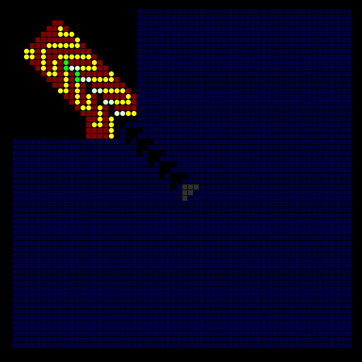
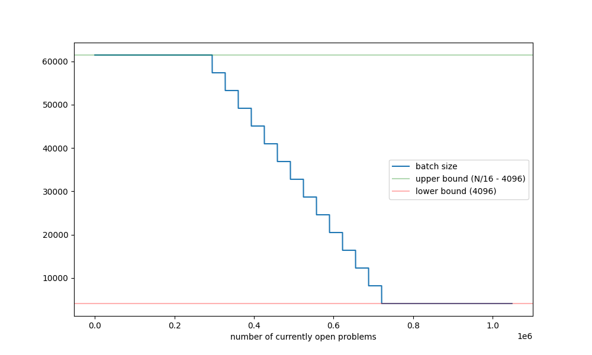

Silk: a CUDA drifter searcher
=============================

**Silk** is a CGoL drifter search program inspired by Mitchell Riley's
[Barrister](https://github.com/mvr/barrister). We port Barrister's
underlying algorithm, modulo a few tweaks, to CUDA in order to benefit
from the much greater parallelism present on GPUs.

- [Quick start](#quick-start)
- Technical overview:
    - [General idea](#general-idea)
    - [Tree search methodology](#tree-search-methodology)
    - [Problem representation](#problem-representation)

Quick start
-----------

There is a [notebook](https://colab.research.google.com/drive/1e0olXyLAFAVE3JDHutqskYNwQiHFVrFm?usp=sharing)
on Google Colab which allows you to run Silk in the cloud, without
needing to have specialised hardware or install anything on your machine.
Google Colab offers a small amount of free credit (a few hours per day
on a Tesla T4 GPU).

Alternatively, if you have your own NVIDIA GPU, then you can run Silk
locally on your own computer. The dependencies are a CUDA compiler
(`nvcc` is recommended, but you can also use Clang), CMake, and git.
You can download Silk by running the following in a terminal (if on
Windows, you'll need to use WSL2 Ubuntu):

    git clone https://gitlab.com/apgoucher/silk.git

Then enter the directory that has just been created:

    cd silk

and compile the code, tuned for whatever GPU architecture you have:

    ./recompile.sh

Then you can run Silk as follows:

    build/src/silk examples/2c3.rle 10 10 10

The first argument, `examples/2c3.rle`, is a LifeHistory RLE file
specifying a search problem. This can be edited using a program such
as Golly, and the different cell colours have different meanings:

- State 0 (black): off in stable background
- State 1 (green): off in stable background + on in active perturbation
- State 2 (blue): unknown in stable background
- State 3 (white): on in stable background
- State 4 (red): like state 0, but must stay off forever
- State 5 (yellow): like state 3, but must stay on forever
- State 6 (grey): at least one of these cells must be on in stable background

In particular we use the state 4 and 5 cells to specify the stator
(unchanging part) of a particular known signal wire, and state 0 and 3
cells to specify the rotor (changing part) of the wire. The signal itself
is state 1 (green) and travels diagonally southeast along the wire. We
leave the termination unknown (blue) so that Silk will search for ways
to complete the signal wire. The state-0 triangles followed by a state-6
triangle is a way to reduce the search space, so that it doesn't waste
time finding lots of copies of the same signal termination differing only
in the length of the wire.

The next three command-line arguments are the maximum width, height,
and cell count of the **active region** (described in the next section).

Silk has a small number of other options that you can control; they
are documented by running the command:

    build/src/silk --help

General idea
------------

The input to Silk is an initial **perturbation** $`P`$ together with a
partially unknown **stable background** $`S`$. The background must be
stable in the sense that $`f(S) = S`$ where $`f`$ is the CGoL rule.
The current generation is the XOR $`P \oplus S`$ of the perturbation
and the background, so the perturbation itself evolves as:

$`P \mapsto f(P \oplus S) \oplus S`$

Silk then performs a search over possible backgrounds $`S`$ subject
to various constraints, including bounds on the population and bounding
box of the **active region** (the restiction of $`P`$ to the immediate
neighbourhood of $`S`$). This is implemented as a binary tree search,
where branching decisions are only made if they affect the perturbation
or the restriction of the stable background to the cells that, in at
least one generation, differ from the background. This ensures that
the search does not needlessly dudplicate branches of search space
that differ only in the [stator](https://conwaylife.com/wiki/Stator).

When a candidate solution is found (either because $`P`$ fizzles out
completely, or optionally enters a sufficiently high-period cycle or
becomes well separated from the live cells in $`S`$ for sufficiently
long), it is given to a SAT solver to find a minimal completion of
the stator. We use [CaDiCaL](https://github.com/arminbiere/cadical)
by Armin Biere as our SAT solver of choice, as it is state-of-the-art
and supports incremental solving.

The main tree search runs on the GPU whilst the SAT solvers run on
CPU threads asynchronously, so the completion of stators does not slow
down the main search.

Tree search methodology
-----------------------

Precursors to Silk, such as Dean Hickerson's **dr** (1997), Mike
Playle's [Bellman](https://conwaylife.com/wiki/Bellman) (2013), and
Mitchell Riley's [Barrister](https://github.com/mvr/barrister) (2022),
performed a depth-first tree search. Depth-first search is inherently
sequential, but a GPU has many independent streaming multiprocessors,
so we implement a parallel variant of depth-first search.

Specifically, we have a priority heap that prioritises nodes with
greater "information content" (something that is monotone-increasing
along any branch of the search tree, so deeper nodes are prioritised
over nodes closer to the root). In each iteration we pop a certain
number $`B`$ of nodes from the heap, process them, and then push any
child nodes back onto the heap. The limit $`B = 1`$ would be depth-
first search, but we use a larger $`B`$ in order to give parallelism.

The heap is Deo and Prasad's vectorised priority heap from their 1992
[paper](https://link.springer.com/article/10.1007/BF00128644), but
implemented in CUDA. We use a vector size of 2048, and the items are
pairs of nodes, so the heap itself stores a multiple of 4096 nodes.
Any leftover nodes are stored in a ring-buffer "staging area" until
we have at least a full vector of 4096 nodes to add to the heap, and
likewise we pop complete vectors (so $`B`$ is constrained to be a
multiple of 4096 as well). In practice we choose $`B`$ as a function
of how full the heap is, to prevent overflowing the available memory:

In particular, when the heap is less than 25% full, we set the batch
size to be the maximum of $`\frac{N}{16} - 4096`$ where $`N`$ denotes
the maximum capacity of the heap. When the heap is more than 75% full,
we set the batch size to be the minimum of 4096. Between those, we
vary it linearly with a gradient of $`-\frac{1}{8}`$ as shown above.

Problem representation
----------------------

In our stable background $`S`$, each cell must be of one of eight
different 'types':

- dead with 0 live neighbours;
- dead with 1 live neighbour;
- dead with 2 live neighbours;
- live with 2 live neighbours;
- live with 3 live neighbours;
- dead with 4 live neighbours;
- dead with 5 live neighbours;
- dead with 6 live neighbours;

which are abbreviated to d0, d1, d2, l2, l3, d4, d5, and d6.

However, in any node of the search tree we only have partial
information about $`S`$. We follow the design of Barrister by having
a Boolean variable per cell for each of these 8 types, specifying
whether or not we know that the cell is definitely not of that type.
These are packed into bitplanes, allowing logical operations to be
performed in parallel at every location in the plane using bitwise
instructions.

As the background is a $`64 \times 64`$ torus, those eight bitplanes
together occupy 4096 bytes. We need another 128 bytes to store the
active perturbation (which is required to fit in a $`32 \times 32`$
box), along with 256 bytes of miscellaneous metadata information,
giving a total of 4480 bytes to represent the pair of problems
obtained when we make a branching decision. (As such, each individual
problem occupies 2240 bytes amortized, and the maximum capacity $`N`$
of the heap is, to a first approximation, the amount of free GPU
memory divided by 2240.)

Main kernel
-----------

The vast majority of the runtime is spent in a GPU kernel, entitled
`computecellorbackup()` as an homage to the function in Hickerson's
**dr** search program responsible for traversing the tree. We launch
$`B`$ threadblocks, each containing a single warp (32 threads). At
a high level, each threadblock of the kernel proceeds as follows:

- load an open problem from global memory into registers;
- perform as many logical inferences about $`S`$ as possible,
   advancing the active perturbation $`P`$ whenever we have
   sufficient information to do so;
- if we enter a cycle or reach a contradiction, terminate;
- otherwise, i.e. we do not have sufficient information to compute
   the next generation of $`P`$, select a cell of $`P`$ whose next
   state is unknown and make a binary decision based on that cell;
- enqueue the two resulting subproblems into the ring buffer.

After the kernel completes, these subproblems are moved from the
ring buffer to the heap, and then we retrieve the next batch of
$`B`$ problems from that heap. (If there are fewer than $`B`$
problems in the heap, then we consume the entire contents of both
the heap and the 'remainder' in the ring buffer.)

Most of the time in `computecellorbackup()` is spent performing
logical inferences: we perform 'soft branching' where we take a
cell in $`S`$ whose state is not fully specified (i.e. more than
one of the eight different types haven't yet been ruled out),
take all of these branches, performing unit propagation and
rollouts, and taking the intersection of the information deduced
in all of the non-contradictory branches. This is all bitsliced
and vectorised: we focus on the $`32 \times 32`$ patch centred
on the current perturbation $`P`$, where each of the 32 threads
holds a row of a bitplane in a 32-bit register; the logic is
then expressible as a complicated sequence of bitwise operations,
left/right shifts, and up/down shuffles.

When we come to choose a cell at the end to bifurcate upon (known as
'hard branching' to distinguish from the 'soft branching' performed
inside the main loop in the kernel), we use a neural network that
was trained on 700 gigabytes of training data produced by Silk. This
reduces the search tree size by several percent. The neural network
was architecturally inspired by the Stockfish chess engine's
[NNUE](https://cp4space.hatsya.com/2021/01/08/the-neural-network-of-the-stockfish-chess-engine/)
and uses local information around the candidate branching cell to
compute a 'value function' of how undesirable it is to split on that
cell; we choose the cell that minimises this function.

In every generation we need to fully know both the cells $`P`$ in
the active perturbation together with the stable state $`S`$
restricted to those cells. In other words, we need to know for every
cell which of the three cases applies:

- **stable**: the cell is equal to the background, so is not part
   of the active perturbation $`P`$.
- **high**: the cell is live in the current generation and dead
   in the background state.
- **low**: the cell is dead in the current generation and live
   in the background state.

If we cannot advance because this information is not known for every
cell in the next generation, we choose a cell and either bifurcate
on "stable vs high/low" (if it's not known whether or not it is
stable on the next generation) or else bifurcate on "high vs low"
(if it's known to not be stable in the next generation, but we don't
know whether it is high or low).

